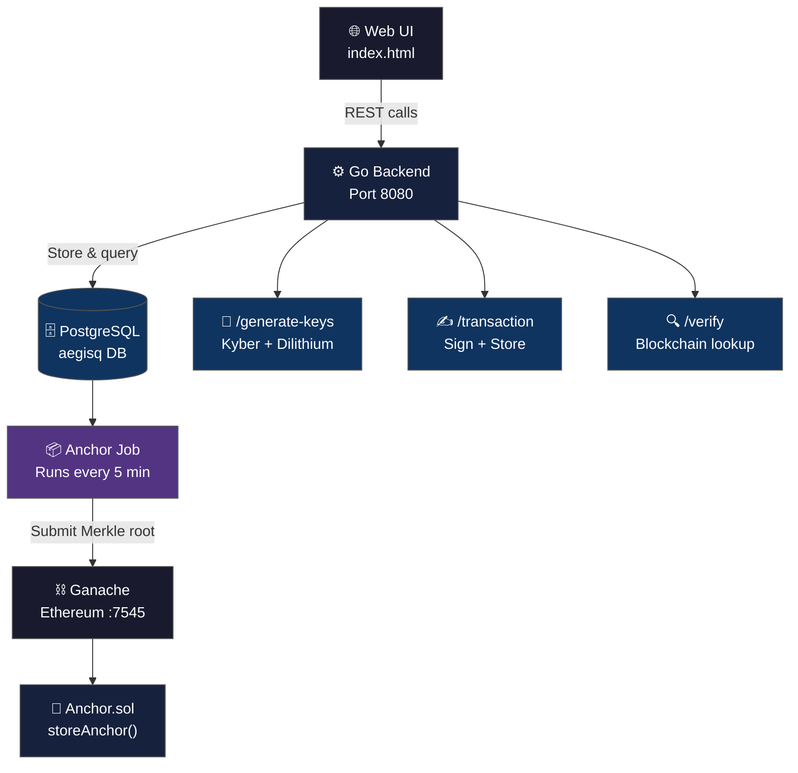
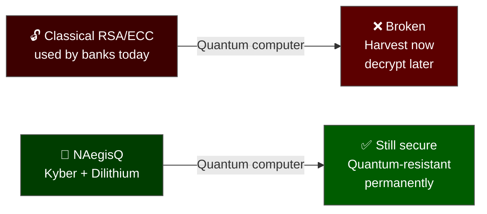
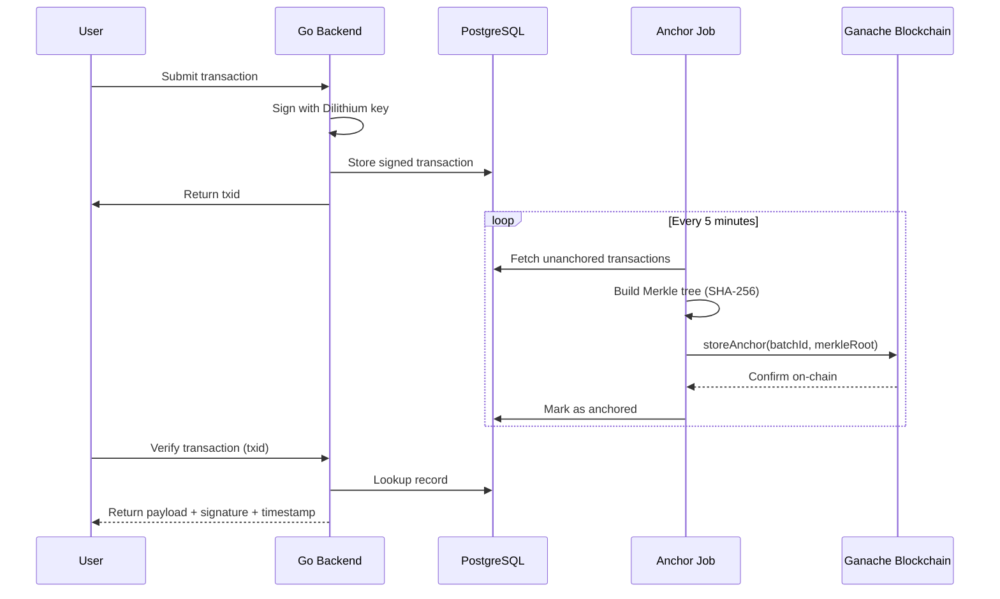

# 🔐 NAegisQ — Quantum-Resistant Banking Security Framework

> **Final Year Project — ZCAS University, Bachelor of Science in Computer Science, 2025**
>
> *Design and Development of NAegisQ: An Integrated Quantum-Resistant Banking Framework with Cryptographic Forensics*


---

## 🧠 Overview

NAegisQ addresses one of the most critical emerging threats in cybersecurity — the ability of quantum computers to break the classical cryptographic algorithms (RSA, ECC) that every banking system in the world currently relies on.

The system unifies three security pillars into a single deployable architecture:

| Pillar | Technology | Purpose |
|--------|-----------|---------|
| **Post-Quantum Cryptography** | ML-KEM-768 (Kyber) + ML-DSA-65 (Dilithium) | Quantum-resistant encryption and digital signatures |
| **Blockchain Forensics** | Ethereum smart contract + Merkle trees | Tamper-proof, immutable audit trails |
| **Secure Backend** | Go + PostgreSQL + RESTful API | Transaction management, key storage, signing |

---

## 🏗️ System Architecture



---

## 🔑 Cryptographic Implementation

### Post-Quantum Algorithms

| Algorithm | NIST Standard | Purpose |
|-----------|--------------|---------|
| **ML-KEM-768 (Kyber-768)** | FIPS 203 | Key encapsulation — quantum-resistant key exchange |
| **ML-DSA-65 (Dilithium)** | FIPS 204 | Digital signatures — transaction signing and identity |

Both algorithms are implemented via the **Open Quantum Safe (OQS) liboqs** library and remain secure against Shor's algorithm — the quantum attack that breaks RSA and ECC.

### Why This Matters



---

## ⛓️ Blockchain Forensic Layer

### Transaction Anchoring Flow



### Smart Contract — Anchor.sol

```solidity
// SPDX-License-Identifier: MIT
pragma solidity ^0.8.0;

contract Anchor {
    event AnchorStored(uint256 indexed batchId, bytes32 merkleRoot, uint256 timestamp);
    mapping(uint256 => bytes32) public anchors;

    function storeAnchor(uint256 batchId, bytes32 merkleRoot) public {
        anchors[batchId] = merkleRoot;
        emit AnchorStored(batchId, merkleRoot, block.timestamp);
    }
}
```

> If any database record is altered or deleted, the mismatch with the anchored Merkle root **immediately exposes the tampering** — making forensic evidence cryptographically verifiable.

---

## 🚀 API Workflow

### Step 1 — System Health Check
```json
GET /health
→ {"service": "AegisQ All-in-One", "status": "quantum_ready", "timestamp": "2025-12-11T09:16:27Z"}
```

### Step 2 — Generate Quantum-Resistant Keys
```json
POST /generate-keys
Body: {"user_id": "alice", "algorithm": "kyber768"}

→ {
    "algorithm": "Kyber768",
    "public_key": "5c603a651a2669c03d842362e1525993ce3326d...",
    "success": true,
    "user_id": "alice"
  }
```

### Step 3 — Submit Signed Transaction
```json
POST /transaction
Body: {"user_id": "alice", "message": "Transfer 5000 ZMW to account 002"}

→ {"id": 12, "success": true, "txid": "5d9f60ea-95a2-411c-b81b-bf74a6d33dd7"}
```

### Step 4 — Verify on Blockchain
```json
GET /transaction/5d9f60ea-95a2-411c-b81b-bf74a6d33dd7

→ {
    "id": 12,
    "txid": "5d9f60ea-95a2-411c-b81b-bf74a6d33dd7",
    "user_id": "alice",
    "payload": {"message": "Transfer 5000 ZMW to account 002"},
    "signed_at": "2025-12-11T09:21:05.5203352"
  }
```

---

## 📁 Repository Structure

```
naegisq/
├── cmd/aegisq-all/
│   ├── main.go                   # API server + anchor job init
│   ├── anchor_job.go             # Background blockchain anchoring
│   └── transaction_handler.go   # POST /transaction handler
│
├── internal/blockchain/
│   ├── anchor.go                 # Go binding for smart contract
│   ├── submit.go                 # Merkle root submission
│   └── merkle.go                 # SHA-256 Merkle tree builder
│
├── anchor-chain/
│   ├── contracts/Anchor.sol      # Solidity smart contract
│   ├── migrations/               # Truffle deployment scripts
│   └── truffle-config.js         # Ganache network config
│
└── web/
    └── index.html                # 4-step web interface
```

---

## ⚙️ Installation

### Prerequisites
```bash
# Go 1.21+, PostgreSQL 14+, Node.js
npm install -g ganache-cli truffle
```

### 1. Start Blockchain
```bash
ganache-cli -p 7545 -d > /tmp/ganache.log 2>&1 &
cd anchor-chain && truffle migrate
```

### 2. Setup Database
```bash
sudo -u postgres psql -c "CREATE ROLE nasa WITH LOGIN PASSWORD 'crypto';"
sudo -u postgres psql -c "CREATE DATABASE aegisq OWNER nasa;"
```

### 3. Run NAegisQ
```bash
cd /opt/aegisq/cmd/aegisq-all
go run main.go anchor_job.go transaction_handler.go
```

### 4. Open Web Interface
```
http://localhost:8080
```

---

## 🧪 Testing Results

| Phase | Scope | Result |
|-------|-------|--------|
| **Unit Testing** | Key generation, signing, API handlers, DB operations | ✅ Passed |
| **System Testing** | End-to-end workflow, blockchain anchoring, concurrency | ✅ Passed |
| **User Acceptance Testing** | Full workflow with representative users | ✅ Passed |

---

## 📋 Compliance Alignment

| Standard | Coverage |
|----------|---------|
| **NIST FIPS 203** | ML-KEM-768 (Kyber) key encapsulation |
| **NIST FIPS 204** | ML-DSA-65 (Dilithium) digital signatures |
| **PCI-DSS 4.0** | Transaction integrity and tamper-proof audit trails |
| **ISO 27037** | Digital forensic evidence — chain of custody |
| **MITRE ATT&CK** | Threat modelling during system design |

---

## 🛠️ Tech Stack

| Layer | Technology |
|-------|-----------|
| Backend | Go (Golang) |
| Database | PostgreSQL + pgxpool |
| Cryptography | Open Quantum Safe (OQS) liboqs |
| Blockchain | Ganache CLI — Ethereum testnet |
| Smart Contract | Solidity 0.8.0 via Truffle |
| Frontend | HTML + Vanilla JavaScript |
| Hardware | Dell R720 (112GB RAM) · MikroTik RB2011 · RTX 3080 |

---

## 🔬 Research Questions Addressed

1. How can a quantum-resistant cryptographic framework using CRYSTALS-Kyber and CRYSTALS-Dilithium ensure identity protection and transaction authorisation?
2. How can a secure Go backend support key generation, transaction signing, and safe data storage?
3. How can a blockchain anchoring mechanism provide cryptographically verifiable audit trails?

---

## 📫 Author

**Nasalifya Simbeye** · ZCAS University · Lusaka, Zambia

nasalifya@outlook.com · [LinkedIn](https://linkedin.com/in/nasalifya-simbeye) · [SOC Home Lab](https://github.com/nasalifya/soc-home-lab)
